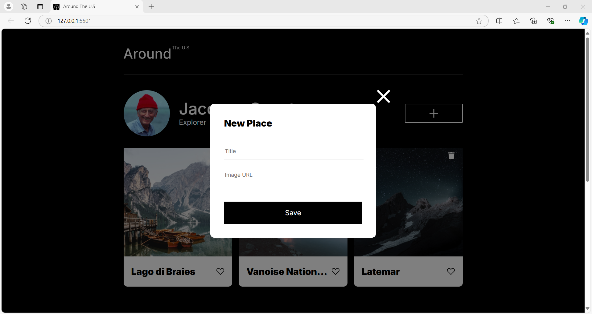
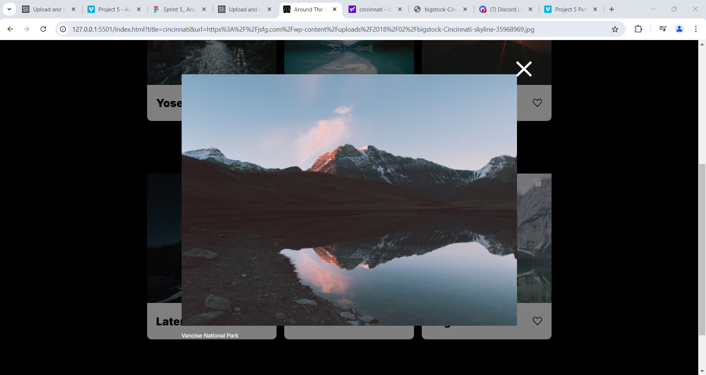
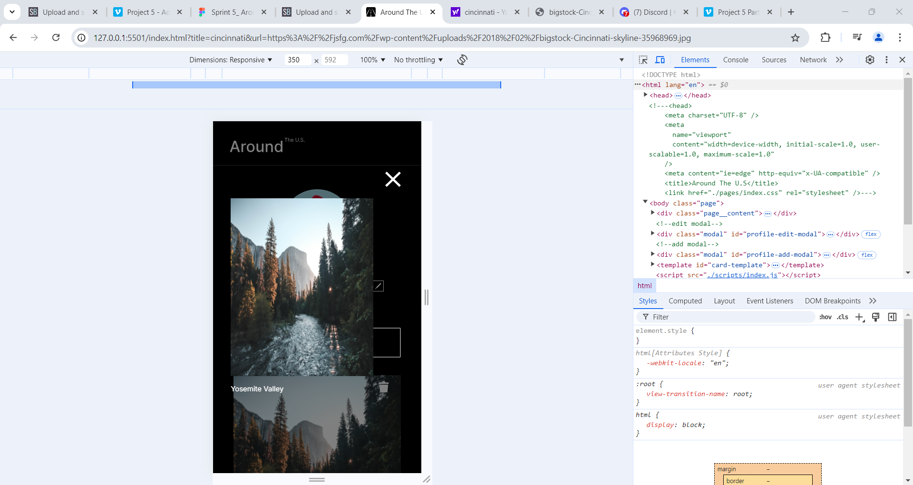

# Project 3: Around The U.S.
## Project name
    Around the U.S.
### Overview  
  
**Intro**
  
This project is about Jacques cousteau who is an explorer and travelled around the US.. This webpage showcasing different places he travelled.
And it has a functionality for users to like the scenaries.

 **Tecnologies** 
 It contanis Html5 and css and abale to support reactive functionalities. The project is hosted by the git which you can share with other developers. And this project is formatted and well structured using prettier.
**Figma** 
* [Link to the project on Figma](https://www.figma.com/file/ii4xxsJ0ghevUOcssTlHZv/Sprint-3%3A-Around-the-US?node-id=0%3A1)  
  
**Images**  
  
  

  
**Github link**
https://github.com/dsrlg/se_project_aroundtheus

**Github docs**
https://dsrlg.github.io/se_project_aroundtheus/index.html

**Video**

https://www.loom.com/share/9ebec823332246ed8109c3e4ca9f63af